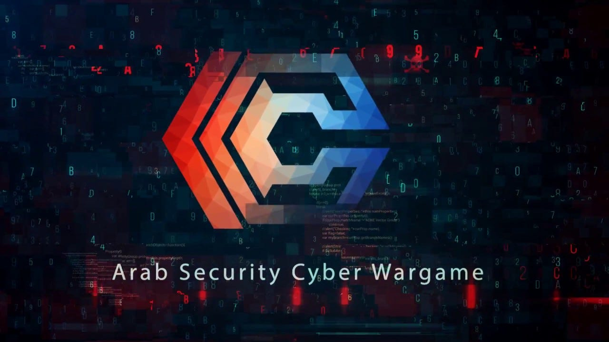

# ASCWGs CTF 2020 Qualifications – Forensics Write-ups

This repository contains **Forensics challenge files and write-ups** from  
**ASCWGs CTF 2020 Qualifications**, organized by challenge name.

## Repository Structure
Each challenge folder includes:
- **The original challenge file(s)**
- **writeup_link.txt** → contains a direct link to the full write-up published on Medium

## Focus
This repository focuses **only on Digital Forensics challenges**, including:
- File analysis  
- Metadata & artifact examination  
- Evidence extraction and interpretation  

The aim is to provide a **clean, well-organized archive** of forensics challenges with detailed external write-ups for learning and reference.

## Author

- LinkedIn: **[Mohamed Gbreil](https://www.linkedin.com/in/0xgbreil/)**

---

